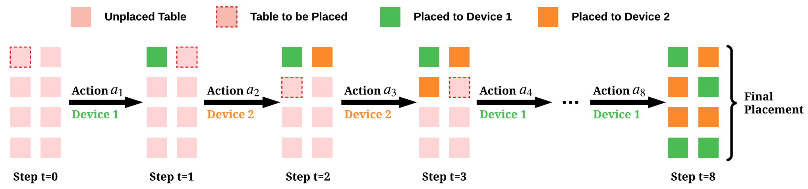

# DreamShard

This is the implementation for the paper [DreamShard: Generalizable Embedding Table Placement for Recommender Systems](https://arxiv.org/abs/2210.02023). We propose DreamShard, a reinforcement learning approach for embedding table placement. DreamShard has two novel ideas. 1) It learns a cost network to directly predict the costs of the fused embedding operations. 2) It trains a policy network by interacting with an estimated Markov decision process (MDP) without real GPU execution. Please refer the paper for more deteails.


## Cite this Work
If you find this project helpful, please cite
```bibtex
@inproceedings{zha2022dreamshard,
  title={DreamShard: Generalizable Embedding Table Placement for Recommender Systems},
  author={Zha, Daochen and Feng, Louis and Tan, Qiaoyu and Liu, Zirui and Lai, Kwei-Herng and Bhargav, Bhushanam and Tian, Yuandong and Kejariwal, Arun and Hu, Xia},
  booktitle={Advances in Neural Information Processing Systems},
  year={2022}
}
```

## Installation

**Step 1: install PyTorch**
```
pip3 install torch
```

**Step 2: install FBGEMM**

Follow the instructions in [https://github.com/pytorch/FBGEMM](https://github.com/pytorch/FBGEMM) to install the embedding operators

**Step 3: install DreamShard**
```
pip3 install -r requirements.txt
pip3 install -e .
```

## Run on the DLRM Dataset

**Step 1: Download DLRM dataset**

Download the data with `git lfs` at [https://github.com/facebookresearch/dlrm_datasets](https://github.com/facebookresearch/dlrm_datasets)

**Step 2: Process the dataset**
```
python3 tools/gen_dlrm_data.py
```
Note that you need to change `--data` argument to the path of the downloaded DLRM dataset.

**Step 3: Generate training and testing tasks**
```
python3 tools/gen_tasks.py --T 50 --out-dir data/dlrm_tasks_50
```
The argument `--T` specifies the number of tables, and `--out-dir` indicates the output directory.

**Step 4: Train DreamShard**
```
python3 train.py --task-path data/dlrm_tasks_50/train.txt --gpu-devices 0,1,2,3 --max-memory 5 --out-dir models/dreamshard
```
Note that you need to specify `--gpu-devices` and `--max-memory` based on your GPU. You also need to specify `--task-path`. `--out-dir` indicates where the trained model will be saved.

**Step 5: Evaluate DreamShard and baselines**
```
python3 eval.py --alg models/dreamshard/9.pt --task-path data/dlrm_tasks_50/test.txt --gpu-devices 0,1,2,3 --max-memory 5
```
Not that you need to specify `--gpu-devices` and `--max-memory` based on your GPU. You also need to specify `--task-path`. `--alg` points to the saved model. Here `9.pt` is the final saved model because we train 10 iterations and save the model after each iteration.

To obtain the results of the baselines, simply change `--alg` to `random`, `dim_greedy`, `lookup_greedy`, `size_greedy`, or `size_lookup_greedy`.
